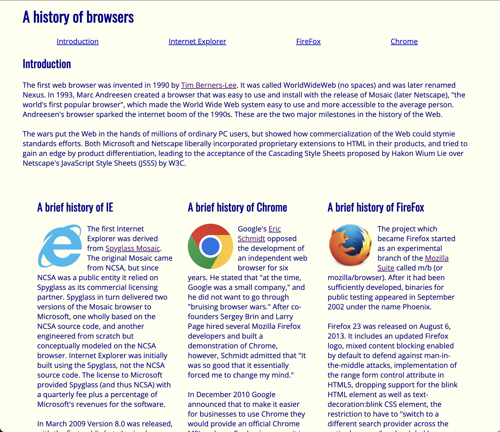
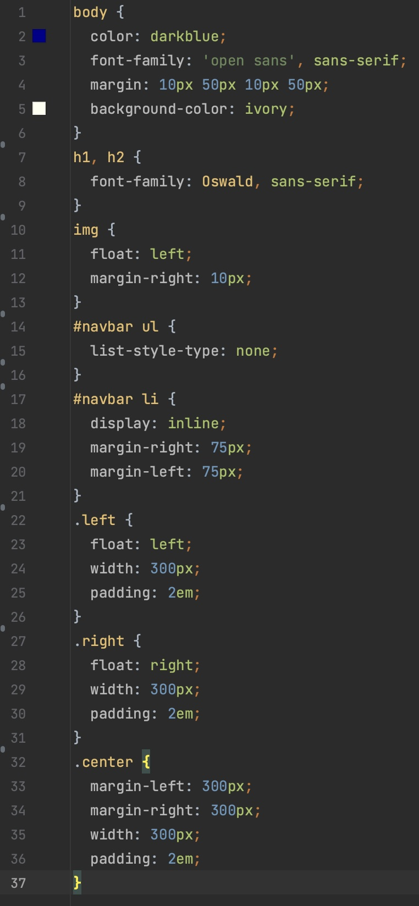
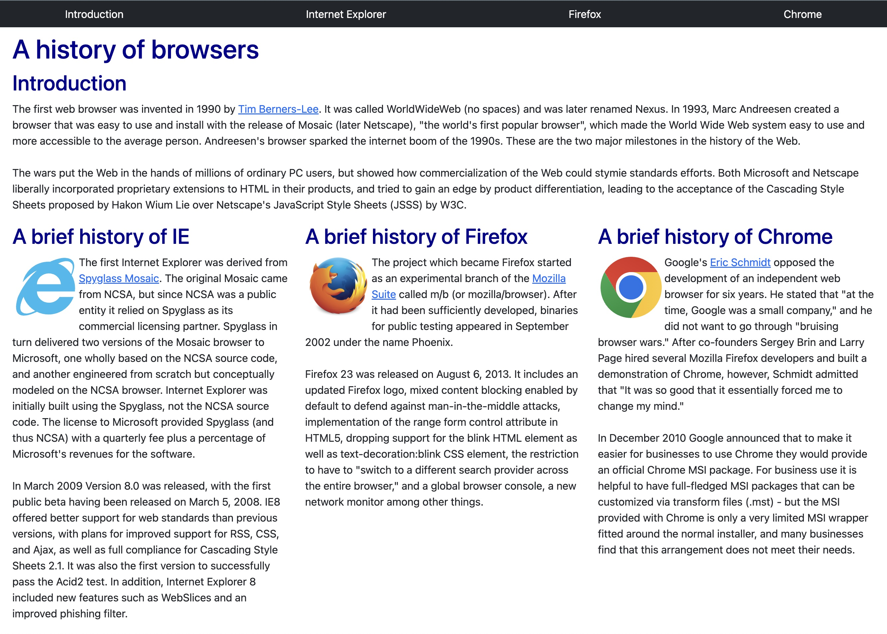
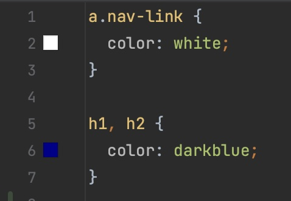

## What Is a Framework and Why Should I Care?
In the realm of programming and software development, a framework is a structured and pre-established set of tools, libraries, conventions, and guidelines that provide some foundation for building applications. Generally, these frameworks can simplify the development process and promote efficiency, consistency, and readability of the codebase. Basically, frameworks can significantly speed up development processes by establishing many common functionalities so developers don't have to spend time reinventing them, allowing them to focus on the specific functionality unique to their projects.

## My Experience with Bootstrap 5
Prior to using Bootstrap, I wrote all my web pages with pure HTML and CSS. As a result, my CSS stylesheets and main index files were always loaded with many small things like padding, margins, and a lot of classes to define things like navbars and footers. Therefore the introduction of Bootstrap was revolutionary and things like creating a navbar were now trivial and could be done in a fraction of the length of the original code. This is because in Bootstrap, you can give an element the <i>navbar</i> class, and all the tedious formatting will be completed for you. However, getting to the point of being able to use Bootstrap effectively was not a smooth path. There was a big learning curve of learning what functions even exist and furthermore picking the correct ones to use for my specific scenario. 

## Bootstrap in Action
Below are some images of the differences in using Bootstrap vs. pure CSS styling and the amount of code to achieve similar designs.

 This is an example of making a simple webpage with pure HTML and CSS and the stylesheet code on the right

    

 This is an example of the same website but with Bootstrap implementation and a simplified stylesheet

 
As a viewer of the site, I personally think that the Bootstrap version of the site is a lot more visually appealing. As the developer of the site, I can appreciate writing much less code to get the same functionality and look of a project.
