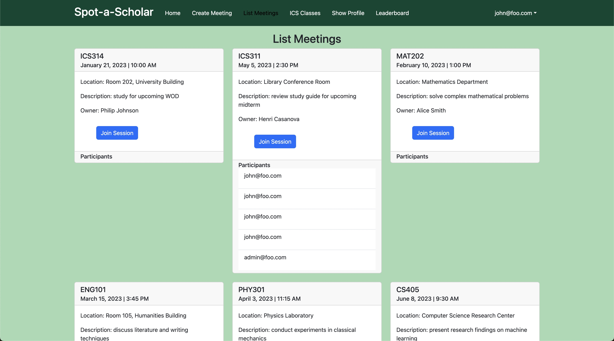

# Spot-a-Scholar
Spot-a-Scholar is a web application developed by a group of 5 people using the skills and concepts developed in ICS 314 throughout the semester. The purpose of this application is to provide a site for students to create and join study sessions for their ICS courses in hopes of encouraging networking and socialization. 
   
On the app, users can sign up for an account and create their profile by specifying their display name, uploading a profile picture, and stating courses they are willing to tutor or get help for. After creating an account, users will then have the option to view meetings that have already been scheduled or host one themselves. 
   
The link to the org page can be found [here](https://spot-a-scholar.github.io/)

# Contributions
The team consisted of: Brayden, Carl, Gavin, Leo, and myself. As a group, we decided to split up work somewhat evenly by having each person work on certain tasks. We organized this by practicing agile project management. More specifically for this project, we used Issue Driven Project Management. This allowed us to distribute work and tasks in the form of issues using GitHub projects where each task will be developed on a branch.
   
My contributions to this project were creating the landing and home pages, organizing how the site flows and what pages are needed, creating the navbar, TestCafe tests, and various other smaller tasks that my teammates had issues resolving. 

# Takeaways
Overall, this project helped me learn a lot about team-oriented development as well as apply the skills and knowledge I have gathered previously from this course. Because of this project, I believe I was able to develop my skills as a software developer and work better in a team environment. 
