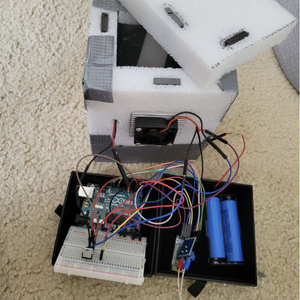
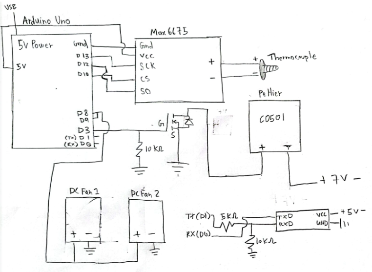
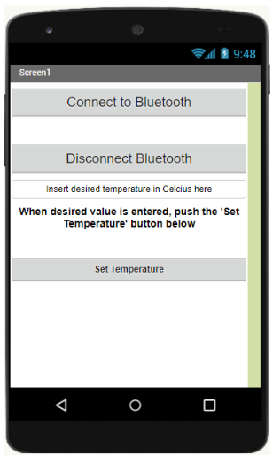

The initial motivation to create ThermoCase was to essentially have a smart and portable mini-fridge. However, as the project progressed, I realized that this device can be used for a lot of scenarios other than just chilling your food and drinks. For example, there are many things that are temperature-sensitive such as pharmaceuticals, biologics, and potentially even organs, all of which require some sort of refrigeration during transport. 

ThermoCase is quite simple and similar to existing refrigeration systems in terms of how it functions. It runs solely off batteries and an Arduino program that checks the internal temperatures of the case and will adjust a Peltier cooler as well as fans to meet desired temperatures. Additionally, there is a companion application that can connect to our cooler via Bluetooth. This application allows for remote monitoring and temperature control. 

